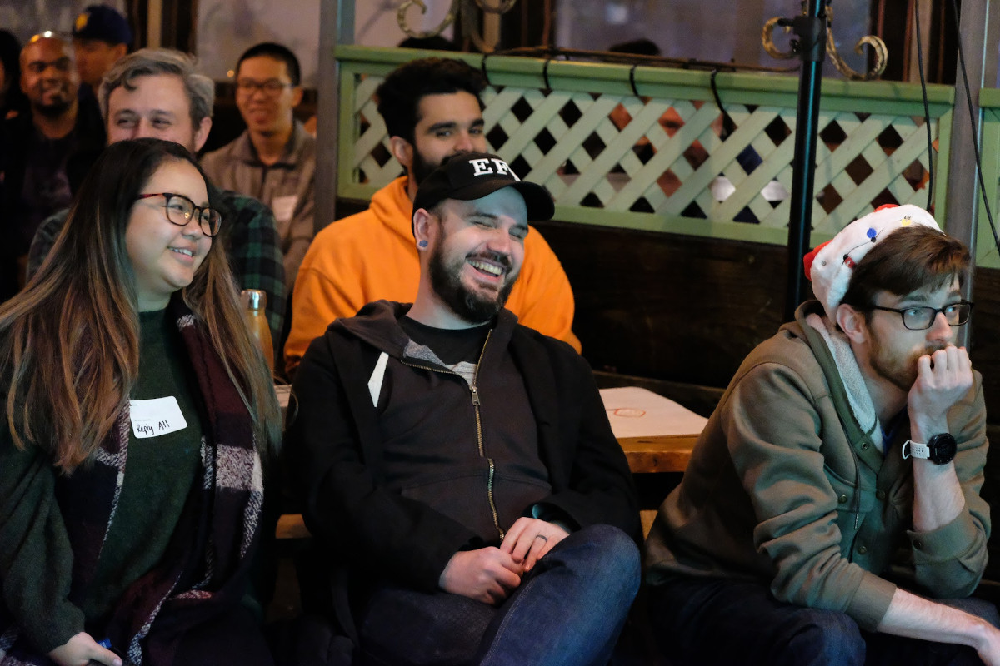

# Sushi, Waffles, and Pizza

I think we first met at [SushiJS](https://www.sushijs.org/), Terin's little meetup at Kama Sushi on 9th street. That place had the awesome kneeling tables, with all our shoes stuffed in cubbies along the hall. It was the first day your name was pronounced correctly in my head, but I'd read it many times before in NodeJS and CouchDB spaces online -- projects I looked up to as I was starting my career.

Over the years, we crossed paths at meetups in the Bay Area and conferences around the world. Every time we caught up, you were a slightly different person, having dived so deep into a new area of interest that we could talk about it for hours.

There was a day in 2017 you invited me and a couple other nerds over for pizza. At the time, pizza was something you were getting deep into, with your characteristic energy and attention to detail:

> "i'm making pizzas, the dough i make from scratch (obviously) and the sauce from tomatos today, and i'll be making the cheese later today"

I remember your large island countertop being absolutely stuffed with ingredients and toppings. You'd grab a ball of dough from a little tupperware in the fridge, flatten it out on the bare marble, and slather it with oil and a thin layer of sauce. I remember the little shimmy move you used to slide the pizzas from a peel to the stone in your oven.

The pizza was fucking awesome.

I think you cranked out 5 or 6 of them, the last being a "dessert pizza" with some kind of honey or sweet glaze.

One of the things I love _so much_ about you is when you figure out something cool, your immediate impulse is to share it with everyone around you. That directly led to several of my happiest memories (and the best pizza) in my 10 years in SF.